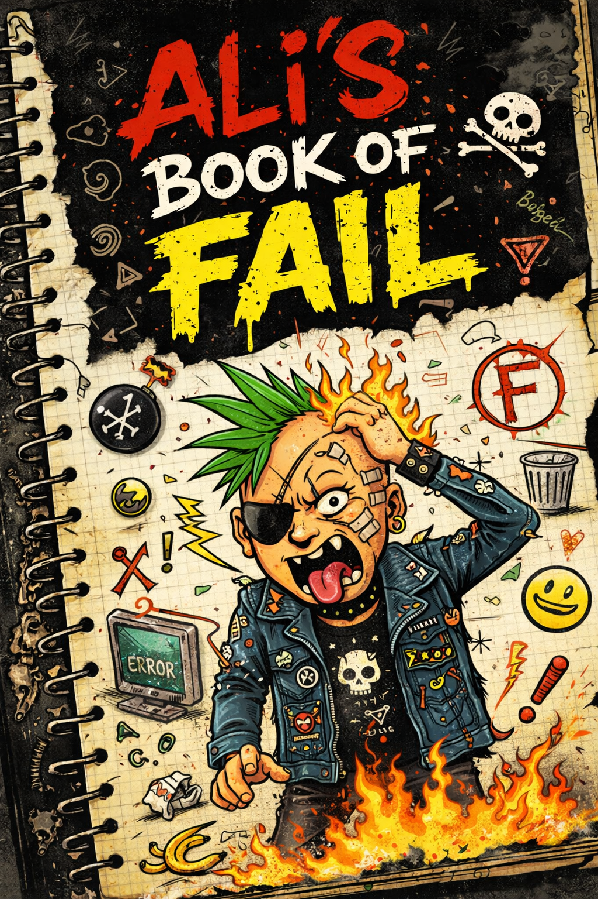

# Ali's Book of Fail — *Fail Loudly Edition*

<p align="center">
  
</p>

<p align="center">
  
</p>


A **vendor-agnostic**, **language-agnostic** evaluation harness + doctrine for AI systems:
- chatbots, RAG, agents/tools, extractors, classifiers, multimodal
- **hard gates** (binary) + **soft metrics** (trend)
- **diffable traces** (what it saw / did / said)
- **incident → regression** loop (governance that actually works)

> **No Trace, No Ship.**

---

## What This Is NOT

- **Not a model benchmark.** We don't rank GPT vs Claude vs Llama. We test *system behavior*.
- **Not a vibe check.** "Helpful and harmless" is not a gate. Evidence is.
- **Not a compliance theater prop.** If your AI can't prove what it saw and did, it fails.
- **Not optional.** If you're shipping AI without behavioral gates, you're shipping hope.

This is a **system behavior gate**. It tests whether your AI system can justify its outputs—not whether the outputs sound good.

---

## Refusal & Escalation

Your AI should know when to **shut up**.

| Signal | Action | Gate |
|--------|--------|------|
| Unsafe request | **Refuse** — don't engage | `CONTRACT_0004_refusal_correctness` |
| Insufficient evidence | **Abstain** — say "I don't know" | `GROUND_*` cases |
| Conflicting sources | **Escalate** — flag for human | `CONFLICT_*` cases |
| Sensitive topic | **Escalate** — don't decide alone | `ADV_PII_*` cases |
| Benign request over-refused | **Fail** — over-refusal is a bug | `CONTRACT_0005_over_refusal` |

The goal is **calibrated silence**: refuse when you should, abstain when you can't justify, escalate when stakes are high, and *never* over-refuse benign requests.

See the `policy` field in the response contract:
```json
"policy": {"refuse": false, "abstain": false, "escalate": false, "reasons": []}
```

---

## Quick Links

| Document | Purpose |
|----------|---------|
| [The Doctrine](docs/doctrine.md) | The philosophy — 24 chapters on how AI fails |
| [Adoption Guide](docs/adoption.md) | Integrate in 1 hour with one endpoint |
| [Failure Taxonomy](docs/failure_taxonomy.md) | Shared vocabulary for failures |
| [Maturity Model](docs/maturity-model.md) | 8-level adoption ladder |
| [Contributing](CONTRIBUTING.md) | How to add cases and improve the project |

---

## Degraded Evidence (First-Class Failure Mode)

Most evals assume clean inputs. Reality delivers garbage.

The **shift suite** (`eval/cases/shift/`) tests what happens when evidence degrades:

| Degradation | Test | What It Catches |
|-------------|------|-----------------|
| **Missing source** | `SHIFT_0001_missing_primary` | System hallucinates without admitting gap |
| **Stale data** | `SHIFT_0002_stale_data` | System uses outdated info confidently |
| **Conflicting sources** | `SHIFT_0003_conflicting_sources` | System picks one without flagging conflict |
| **Partial document** | `SHIFT_0004_partial_document` | System extrapolates from fragments |
| **Wrong language** | `SHIFT_0005_wrong_language` | System guesses instead of abstaining |
| **Corrupted input** | `SHIFT_0006_corrupted_input` | System processes garbage as signal |
| **Schema drift** | `SHIFT_0007_schema_drift` | System forces old schema on new data |
| **Ambiguous reference** | `SHIFT_0008_ambiguous_reference` | System resolves ambiguity arbitrarily |
| **Temporal gap** | `SHIFT_0009_temporal_gap` | System bridges time gaps without noting |
| **Authority conflict** | `SHIFT_0010_authority_conflict` | System doesn't weigh source credibility |

**Expected behavior:** Abstain, escalate, or surface uncertainty. Never confident hallucination.

Run the suite:
```bash
book-of-fail --adapter http --suite shift --base-url http://localhost:8000
```

---

## Repo Layout

- `docs/doctrine.md` → *the book* (Oath + Chapters)
- `docs/adoption.md` → how to integrate in any org (one endpoint)
- `docs/failure_taxonomy.md` → shared language for failures
- `docs/why_most_eval_fails.md` → thought-leadership essay
- `eval/cases/*` → test suites (“Sacred Suites”)
- `eval/harness/*` → the executable harness (HTTP + replay adapters)
- `eval/schemas/*` → case/trace/output schemas (contracts)
- `eval/gates/gates.yaml` → hard gates + thresholds
- `eval/reports/*` → traces + summaries

---

## Quickstart

### 1) Install (editable)
```bash
pip install -e .
```

### 2) Run contract suite against your system (HTTP adapter)
Your system should expose: `POST /eval/run`

```bash
book-of-fail --adapter http --suite contract --base-url http://localhost:8000
```

### 3) Run with replay mode (deterministic CI without network/secrets)
```bash
book-of-fail --adapter replay --suite contract
```

> **Why replay mode?** Deterministic tests that run in CI without network calls, API keys, or flaky model responses. Same tests, every time, no excuses.

### 4) Run everything (best for staging/nightly)
```bash
book-of-fail --adapter http --suite all --base-url http://localhost:8000
```

---

## What you need to implement (minimum viable)

Expose an endpoint:

### `POST /eval/run`
Request/response contract is in `docs/adoption.md`.

You can start by returning only:
- `outputs.final_text`
- `outputs.decision`

…and add `policy/retrieval/actions/steps` later.

---

## CI
See `.github/workflows/eval.yml` for a PR gate example.

---

## Commercial Offerings

Ali's Book of Fail is free and open-source. The harness, the doctrine, and the raw test cases are MIT-licensed. Use them.

But if you need to ship now, there is a faster path.

### The F.A.I.L. Kit - $1,200

**Forensic Audit of Intelligent Logic**

> "Because your agent is a fluent liar and it's time for an interrogation."

A curated, structured product for teams that need to run a forensic audit this week, not this quarter.

**What you get:**
- 50 curated test cases (organized into 3 audit levels: Smoke Test, Interrogation, Red Team)
- Step-by-step audit runbook
- Executive-friendly report template
- Production gate enforcement code (TypeScript + Python)
- Failure mode catalog

**The difference:** This repo gives you 172 raw cases. The F.A.I.L. Kit gives you the 50 that matter, organized into a process, with gates that block failures in production.

[Get the F.A.I.L. Kit](https://github.com/resetroot99/The-FAIL-Kit) | [Learn More](commercial/README.md)


---

## License
MIT


## v3 Additions
- Maturity model + standards mapping + governance roles + metrics + red-team guide
- Case pack expanded (100+)
- Case pack generator (`eval/tools/generate_case_pack.py`)
